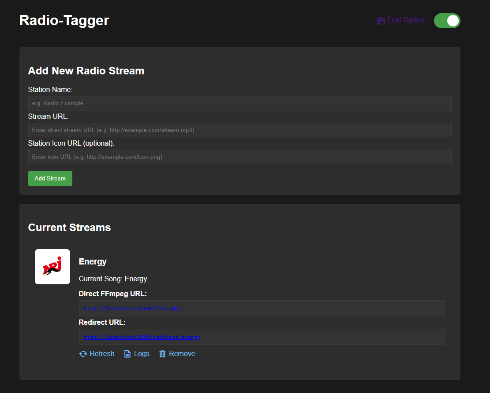
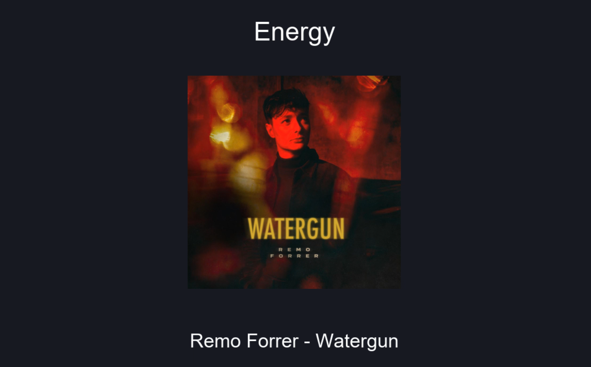

# Radio-Tagger

A web app that converts audio streams into video streams with metadata overlays, making it easy to add radio stations to Jellyfin with proper song information display. This works only if the radio station directly supplies ICY Metadata.

## Screenshots

Here some screenshots how the app looks, a simple UI is enough here.



Here how it looks in a player like VLC or Jellyfin.



## Problem

Adding radio streams to Jellyfin is cumbersome and doesn't show currently playing song information. Radio-Tagger solves this by creating video streams with dynamic overlays that display current song metadata.

## Features

- Converts audio streams to video streams with metadata
- Dynamic overlay showing station name and current song
- Web interface for managing multiple streams
- Direct HTTP URLs for easy Jellyfin integration
- Optional station icons/artwork
- Dark/light mode support

## Requirements

- Python 3.8+
- FFmpeg
- Dependencies: see `requirements.txt`

## Installation

1. Clone the repository:
```bash
git clone https://github.com/CrazyWolf13/radio-tagger.git
cd radio-tagger
```

2. Install dependencies:
```bash
cd app
pip install -r requirements.txt
```

3. Ensure FFmpeg is installed and in your PATH

## Usage

### Development

Run the development server with auto-reload:
```bash
uvicorn main:app --reload --host 127.0.0.1 --port 8000
```

Access the web interface at `http://localhost:8000`

### Production

For production deployment:

1. Configure your firewall to allow incoming connections
2. Run the app on your Jellyfin host:

```bash
cd app
uvicorn main:app --host 0.0.0.0 --port 8000 --workers 1
```

#### Systemd Service (Linux)

Create `/etc/systemd/system/radio-tagger.service`:
```ini
[Unit]
Description=Radio-Tagger Service
After=network.target

[Service]
User=your-user
WorkingDirectory=/path/to/radio-tagger/app
ExecStart=/usr/local/bin/uvicorn main:app --host 0.0.0.0 --port 8000 --workers 1
Restart=always

[Install]
WantedBy=multi-user.target
```

Enable and start the service:
```bash
sudo systemctl enable radio-tagger
sudo systemctl start radio-tagger
```

The app will bind to `0.0.0.0:8000` allowing external access.

### Adding Streams to Jellyfin

1. Add a radio station through the web interface
2. Copy the "Redirect URL"
3. In Jellyfin:
   - Go to Dashboard → Libraries → Add Media Library
   - Choose "Movies" as content type
   - Add the stream URL

## Finding Radio Streams

Click "Find Radios" in the top right or visit [radio-browser.info](https://www.radio-browser.info/map) for stream URLs.

## Troubleshooting

- **Connection refused**: Check Windows/Linux Firewall settings and allow FFmpeg through
- **No metadata**: Some streams simply don't provide any ICY metadata
- **Stream stops**: Use the refresh button to restart a stream

## License

GPL-3.0 License - see LICENSE file for details

## Author

[CrazyWolf13](https://github.com/CrazyWolf13)